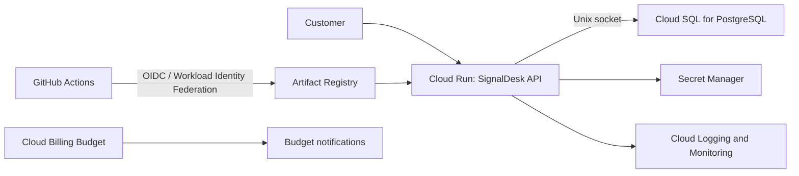

# SignalDesk Cloud Launch

A production-minded Google Cloud reference implementation for a small service
business that needs online appointment booking without operating servers or
Kubernetes.

This repository is a SignalOps proof asset for the **Cloud Foundation Launch**
service. It demonstrates application delivery, infrastructure as code,
least-privilege identity, observability, rollback, recovery planning, and cost
guardrails in one deployable project.

## Business scenario

SignalDesk is a fictional appointment API for a small field-services company.
The company has a lean engineering team and needs:

- a secure production launch on GCP;
- repeatable infrastructure and application deployments;
- a managed PostgreSQL database with backups;
- useful logs, health checks, and alerts;
- no long-lived Google Cloud keys in GitHub;
- a documented rollback and recovery path;
- budget alerts and an explicit teardown procedure.

## Architecture



The first iteration uses the Cloud Run service URL. A global HTTPS load
balancer, custom domain, Cloud Armor, private IP, and multi-region recovery are
explicit production-hardening extensions rather than hidden prerequisites.

## Repository layout

```text
.
├── .github/workflows/       # Application and Terraform pipelines
├── app/                     # FastAPI booking service
├── docs/                    # Architecture, security, cost, and runbooks
├── terraform/
│   ├── bootstrap/           # Remote-state and CI identity prerequisites
│   └── environments/dev/    # Deployable development environment
├── docker-compose.yml       # Local PostgreSQL environment
└── Makefile                 # Common local commands
```

## Local quick start

Requirements: Docker with Compose, Python 3.12+, and GNU Make.

```bash
cp .env.example .env
docker compose up --build
```

Verify the service:

```bash
curl http://localhost:8080/health/live
curl http://localhost:8080/health/ready
curl -X POST http://localhost:8080/api/v1/bookings \
  -H 'content-type: application/json' \
  -d '{"customer_name":"Avery Johnson","customer_email":"avery@example.com","service":"HVAC inspection","scheduled_at":"2026-08-15T14:00:00Z"}'
```

Interactive API documentation is available at
`http://localhost:8080/docs`.

## Test and validate

```bash
make install
make test
make lint
make terraform-check
make docker-build
```

## GCP deployment path

1. Configure the values in `terraform/bootstrap/terraform.tfvars` and deploy
   the state bucket and GitHub workload identity.
2. Configure `terraform/environments/dev/terraform.tfvars`.
3. Deploy the development infrastructure.
4. Configure the GitHub repository variables documented in
   `docs/deployment.md`.
5. Push to `main` to publish the image and deploy a Cloud Run revision.
6. Execute the smoke test, rollback drill, and recovery checklist.

The Cloud Run resource ignores application image drift intentionally: Terraform
owns the platform configuration while the application pipeline owns revision
promotion.

## Definition of done

The portfolio project is complete only when the evidence in
`docs/acceptance-criteria.md` has been captured. A successful Terraform apply by
itself is not considered completion.

## Current status

- [x] Architecture and acceptance criteria
- [x] Local booking API and container
- [x] Terraform foundation
- [x] CI and deployment workflow scaffolding
- [ ] Deploy development environment
- [ ] Capture rollback and alert evidence
- [ ] Run backup/restore drill
- [ ] Publish final portfolio case study

## Responsible publishing

This is a reference implementation, not a client case study. Published results
must be described as lab measurements and must not expose project numbers,
billing identifiers, database credentials, or raw customer data.
