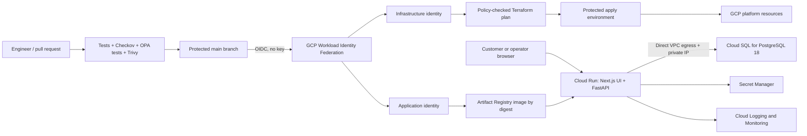

# SignalDesk Cloud Launch

A production-minded Google Cloud reference implementation for a small service
business that needs online appointment booking without operating servers or
Kubernetes.

This repository is a SignalOps proof asset for the **Cloud Foundation Launch**
service. It demonstrates application delivery, infrastructure as code,
least-privilege identity, observability, rollback, recovery planning, and cost
guardrails in one deployable project.

## Business scenario

SignalDesk is a fictional end-to-end booking application for a small
field-services company. Customers select a live service slot and operations
staff can search, filter, complete, or cancel the resulting booking.
The company has a lean engineering team and needs:

- a secure production launch on GCP;
- repeatable infrastructure and application deployments;
- a managed PostgreSQL database with backups;
- useful logs, health checks, and alerts;
- no long-lived Google Cloud keys in GitHub;
- a documented rollback and recovery path;
- budget alerts and an explicit teardown procedure.

## Architecture

The published architecture is split into two reviewable views so the runtime
trust boundary is not confused with the delivery trust boundary.




The first iteration uses the Cloud Run service URL. A global HTTPS load
balancer, custom domain, Cloud Armor, IAM database authentication, HA, and
multi-region recovery remain explicit production extensions.

## Repository layout

```text
.
├── .github/workflows/       # PR gates, secure delivery, and deployment
├── app/
│   ├── frontend/            # Next.js customer and operations interface
│   └── signaldesk/          # FastAPI API and packaged static frontend
├── docs/                    # Architecture, security, cost, and runbooks
├── policy/terraform/        # SignalOps OPA/Rego plan policies and tests
├── scripts/                 # Verified tool installers and policy gate
├── security/                # Pinned security tooling
├── terraform/
│   ├── bootstrap/           # Remote-state and CI identity prerequisites
│   └── environments/dev/    # Deployable development environment
├── docker-compose.yml       # Local PostgreSQL environment
└── Makefile                 # Common local commands
```

## Local quick start

Requirements: Docker with Compose, Python 3.12+, and GNU Make.

```bash
cp .env.example .env
docker compose up --build
```

Open `http://localhost:8080` to use the booking application. Verify the API
directly when troubleshooting:

```bash
curl http://localhost:8080/health/live
curl http://localhost:8080/health/ready
curl -X POST http://localhost:8080/api/v1/bookings \
  -H 'content-type: application/json' \
  -d '{"customer_name":"Avery Johnson","customer_email":"avery@example.com","service":"HVAC inspection","scheduled_at":"2026-08-15T14:00:00Z"}'
```

Interactive API documentation is available at
`http://localhost:8080/docs`.

## Test and validate

```bash
make install
make test
make lint
make frontend-check
make frontend-e2e
make terraform-check
make security-check
make docker-build
make trivy-image
```

## GCP deployment path

1. Review and locally apply `terraform/bootstrap`; it is the trust root and is
   intentionally excluded from automatic delivery.
2. Migrate bootstrap state into the protected state bucket it created.
3. Create the three GitHub environments and repository variables documented in
   `docs/deployment.md`.
4. Open a pull request and require the application, Terraform, actionlint,
   Checkov, OPA, Trivy, and dependency gates.
5. Merge to `main`. GitHub plans and policy-checks the development
   infrastructure, applies the exact reviewed plan, scans the application
   image, deploys it without traffic, smoke-tests it, and then promotes it.
6. Execute the rollback and recovery drills and capture evidence.

The Cloud Run resource ignores the application image and release-generated
revision/client metadata intentionally: Terraform owns the platform
configuration while the application pipeline owns immutable image promotion.

## Definition of done

The portfolio project is complete only when the evidence in
`docs/acceptance-criteria.md` has been captured. A successful Terraform apply by
itself is not considered completion.

## Current status

- [x] Architecture and acceptance criteria
- [x] Local booking API and container
- [x] Responsive customer booking and operations interface
- [x] Desktop and mobile end-to-end browser journeys
- [x] Terraform foundation
- [x] Keyless CI/CD and DevSecOps policy gates
- [x] Private database networking and cost guardrails
- [x] Locally validated bootstrap plan
- [x] Apply bootstrap trust root and migrate its state
- [x] Deploy development environment and application
- [x] Capture runtime, keyless delivery, and zero-drift evidence
- [ ] Capture rollback and alert evidence
- [ ] Run backup/restore drill
- [x] Publish the repository case study
- [x] Update the case study for the verified full-stack release
- [x] Capture and sanitize the organized screenshot evidence set
- [ ] Publish the educational Medium article
- [ ] Publish the case study on the cloudwithlucien.com portfolio

The sanitized [bootstrap verification record](docs/evidence/bootstrap-verification.md)
captures the reviewed plan, OPA decision, apply result, remote-state migration,
and zero-drift check without publishing credential or billing material. The
[deployment verification record](docs/evidence/deployment-verification.md)
captures the promoted application, immutable image, private database path,
keyless identities, acceptance test, correlated log, cost controls, and final
no-change Terraform run.

## Responsible publishing

This is a reference implementation, not a client case study. Published results
must be described as lab measurements and must not expose project numbers,
billing identifiers, database credentials, or raw customer data.

The development operations board intentionally uses synthetic records and is
not protected by staff identity. Before using the pattern with real customer
data, add an application identity provider and role-based authorization for all
booking-list and booking-update routes. This constraint is visible in the UI
and documented in [the application guide](docs/application.md).

Start with [the DevSecOps walkthrough](docs/devsecops.md) to understand how the
files and delivery stages connect. The complete deployment order is in
[the deployment guide](docs/deployment.md), and the browser-to-database flow is
in [the application guide](docs/application.md).

For a single end-to-end narrative, read the
[technical portfolio case study](docs/portfolio-writeup.md). When collecting
visual proof for an article or interview, follow the
[screenshot capture guide](docs/evidence/screenshot-guide.md) so every image
has a specific control, explanation, and redaction rule.
