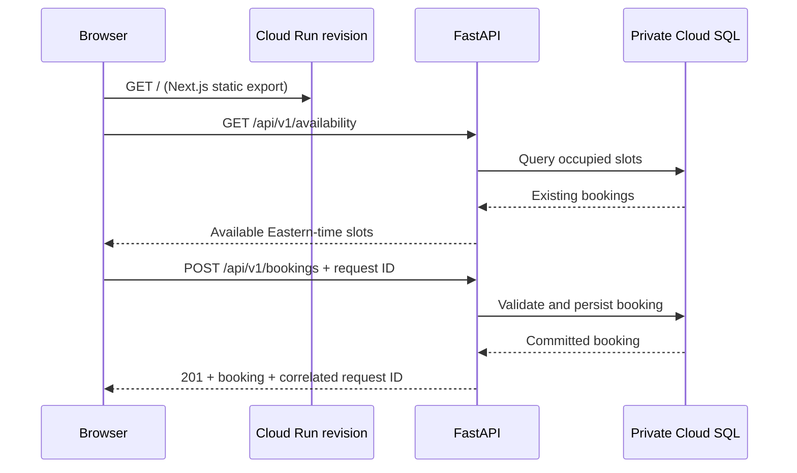

# Architecture decisions

## Published architecture views

The runtime view answers how a browser request reaches a privately addressed
database. The delivery view answers who may change that runtime and what
evidence must exist before either Terraform or an application revision is
promoted.

## Why Cloud Run

The target client needs a managed container runtime, not a Kubernetes platform.
Cloud Run keeps the application portable while removing cluster and node
operations. Scaling is bounded to protect the database and the budget.

## Why Cloud SQL

Bookings are transactional and benefit from relational constraints and familiar
PostgreSQL tooling. A managed database provides automated backups and a clear
recovery path. The development environment is zonal; high availability is an
explicit production upgrade based on the client's recovery requirements.

## Application runtime

The production image is built in three stages. Node compiles the Next.js
interface to static files, Python installs only backend production packages,
and the final non-root Python image receives both outputs. FastAPI serves the
static interface at `/` and the JSON API under `/api/v1`, so the browser uses a
single Cloud Run origin and does not require CORS or a second always-on service.

Cloud Run's runtime service account authorizes access to Secret Manager and the
Cloud SQL instance. It does not replace the PostgreSQL login: the application
reads the database password from its injected secret and uses the private Unix
socket created by the Cloud SQL integration. Each HTTP response carries a
request ID that is also written to structured Cloud Logging.

## Infrastructure and application ownership

Terraform owns APIs, IAM, Artifact Registry, Cloud SQL, Secret Manager, Cloud
Run configuration, monitoring, and budgets. The deployment workflow owns the
Cloud Run container image and revision promotion. Terraform ignores the image,
generated revision name, and deployment-client metadata to prevent the two
delivery paths from fighting each other. Networking, identity, scaling, probes,
resources, secrets, and service exposure remain Terraform-owned and
drift-detected.

## Private data path

Cloud SQL has no public IPv4 address. It attaches to a custom VPC through
Private Service Access, and Cloud Run reaches private ranges with Direct VPC
egress. Direct VPC egress avoids the always-on instance cost of a Serverless VPC
Access connector. The subnet has flow logs and an explicit logged deny-ingress
rule. Database connections also require trusted client certificates; the Cloud
SQL connector handles those certificates for the application.

## Trust boundaries

Bootstrap is a deliberately small, locally operated trust root. It creates the
state bucket, GitHub identity federation, and two service accounts. It does not
run on every push.

Normal delivery uses separate Workload Identity pools and service accounts:

- the infrastructure identity can manage the development platform and state;
- the application identity can write images and deploy Cloud Run revisions;
- neither identity has a downloadable key;
- GCP accepts tokens only for immutable GitHub repository and owner IDs,
  trusted workflow paths on `main`, and the expected GitHub environment.

## Deliberate first-release constraints

- One GCP region.
- Cloud Run URL instead of a custom domain and global load balancer.
- Private Cloud SQL address reached through Direct VPC egress.
- Zonal development database.
- Password authentication with the password held in Secret Manager.
- A public, synthetic-data operations board for demonstration; staff identity
  and role-based authorization are required before real customer use.

These constraints keep the lab affordable and buildable. The production design
review must consider IAM database authentication, HA, custom domain, Cloud
Armor, customer-managed encryption keys, and a tested regional recovery
strategy. Point-in-time recovery is already enabled in the development lab.
