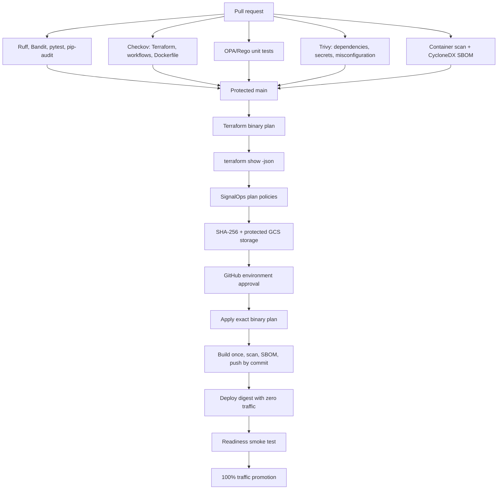

# DevSecOps walkthrough

This document explains how the repository moves from a code change to a
verified GCP release and why each control exists.

## The delivery model



## Why three security tools are not duplication

| Tool | Input | Question it answers | Example in this project |
|---|---|---|---|
| Checkov | Terraform, workflow YAML, Dockerfile | Does the source match a broad catalog of secure configuration patterns? | It detected public Cloud SQL networking and missing database audit flags. |
| OPA/Rego | Terraform plan JSON | Does the actual proposed change obey SignalOps business rules? | It blocks protected-resource deletion, public non-dev services, missing labels, and Cloud Run scaling above three. |
| Trivy | Repository and built image | Are there known vulnerabilities, secrets, or misconfigurations in what will ship? | It scans OS and Python packages and creates the CycloneDX SBOM. |

`pip-audit` adds an ecosystem-specific advisory check, while Ruff, Bandit, and
pytest cover code quality, Python security patterns, and behavior. The overlap
is intentional defense in depth: a source scanner cannot prove which image
packages were installed, and an image scanner does not understand a proposed
Terraform deletion.

## How GitHub authenticates without a cloud key

1. A job declares `id-token: write`. This allows GitHub to mint a signed OIDC
   token for that job; it does not grant GCP access by itself.
2. The token contains claims such as repository ID, owner ID, branch, workflow
   path, reusable workflow path, and GitHub environment.
3. The GCP Workload Identity provider validates the signature and exact claim
   conditions.
4. A matching principal may impersonate one specific GCP service account.
5. GitHub receives a short-lived credential. The authentication action removes
   its credential file after the job.

There are separate Workload Identity pools for infrastructure and application
delivery. A token admitted to the application pool cannot use the
infrastructure pool's impersonation binding. Immutable numeric repository and
owner IDs prevent a renamed or recycled repository from inheriting trust.

## Why plan and apply are separate

Running `terraform apply` with no saved plan creates a new plan immediately
before changing infrastructure. That means the human may approve one proposal
but the runner applies another after code, state, or provider behavior changes.

This pipeline creates `tfplan`, evaluates its JSON, hashes it, and stores the
binary and checksum in the state bucket. The approval job downloads both,
verifies SHA-256, and runs `terraform apply tfplan`. The approved artifact is
therefore the applied artifact. Remote GCS state locking prevents concurrent
writers, while GitHub concurrency prevents overlapping main deliveries.

## Why application promotion has two stages

The deployment job builds the release candidate once and scans that same local
image before pushing it. Artifact Registry resolves the pushed tag to a digest,
and Cloud Run deploys the digest rather than a mutable tag. The new revision
receives zero normal traffic. Its tagged candidate URL is smoke-tested; only a
passing revision receives 100% traffic. A failed smoke test leaves the previous
revision serving users.

## Supply-chain decisions

- Third-party GitHub Actions are pinned to full commit SHAs, not floating tags.
- OPA and Trivy versions and SHA-256 checksums live in installer scripts.
- actionlint is also checksum-pinned and validates workflow semantics.
- Checkov and pip-audit versions are pinned in `security/requirements.txt`.
- The multi-architecture Python base image is pinned to its registry digest.
- Dependabot proposes updates through the normal review gates.
- The application image is scanned at PR time and again immediately before
  release, then recorded as a CycloneDX SBOM artifact.
- Installer scripts use official release artifacts directly. This makes the
  expected binary digest reviewable and limits trust in wrapper actions.

## Local commands and expected evidence

```bash
make install
make lint                 # Ruff and Bandit pass
make test                 # Application tests pass
make security-check       # pip-audit, Checkov, OPA, and Trivy pass
make trivy-image          # Built image has no blocking HIGH/CRITICAL finding
```

To evaluate an actual plan:

```bash
terraform -chdir=terraform/environments/dev show -json tfplan > /tmp/tfplan.json
make opa-eval PLAN_JSON=/tmp/tfplan.json
```

OPA prints every denial and exits non-zero when the set is not empty. Unit tests
in `policy/terraform/signaldesk_test.rego` verify both allowed and denied
examples so a policy refactor cannot silently turn the gate off.

## File connection map

| File | Role | Connects to |
|---|---|---|
| `.github/workflows/ci.yml` | Reusable application quality gate | Called by pull requests and `delivery.yml` |
| `.github/workflows/terraform.yml` | Reusable format/validate gate | Both Terraform roots |
| `.github/workflows/security.yml` | Reusable Checkov/OPA/Trivy gate | `.checkov.yml`, `policy/`, `scripts/`, `security/` |
| `.github/workflows/delivery.yml` | Trusted `main` orchestrator | Infrastructure plan/apply and `deploy.yml` |
| `.github/workflows/deploy.yml` | Reusable release workflow | Artifact Registry and Cloud Run |
| `terraform/bootstrap/` | One-time trust root | GCS state, WIF pools, deployer service accounts |
| `terraform/environments/dev/` | Normal platform configuration | VPC, Cloud SQL, Secret Manager, Cloud Run, monitoring, budget |
| `policy/terraform/signaldesk.rego` | Organization-specific plan rules | Terraform plan JSON |
| `scripts/evaluate-terraform-policy.sh` | Fail-closed OPA adapter | Called locally and by `delivery.yml` |

## Interview explanation

Use this concise sequence:

> I separated the trust bootstrap from normal delivery. Pull requests have no
> cloud write credentials and must pass code, IaC, policy, secret, dependency,
> and image gates. On main, GitHub exchanges an OIDC token for a short-lived,
> workflow-bound GCP identity. Terraform produces one binary plan, OPA evaluates
> the real plan, and the pipeline hashes and stores it. A protected environment
> approves and applies that exact artifact. The application is scanned, pushed,
> resolved to an immutable digest, deployed with zero traffic, smoke-tested, and
> only then promoted. Infrastructure and application identities are isolated,
> so a normal app release cannot rewrite cloud IAM or state.

Be ready to discuss the deliberate tradeoffs: a zonal development database,
Google-managed encryption, password authentication, and a public demo API keep
the proof asset buildable and affordable. HA, IAM database authentication,
customer-managed keys, rate limiting, and a load balancer are production
options selected from client RTO, RPO, threat, and budget requirements.
