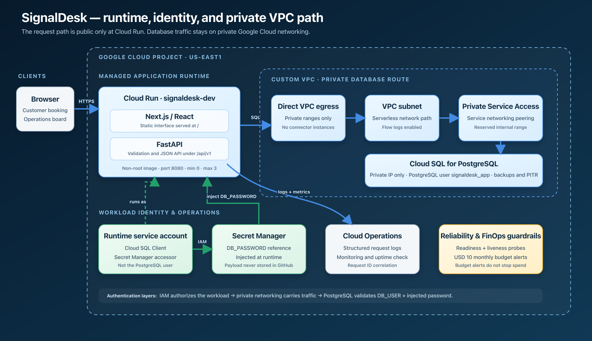
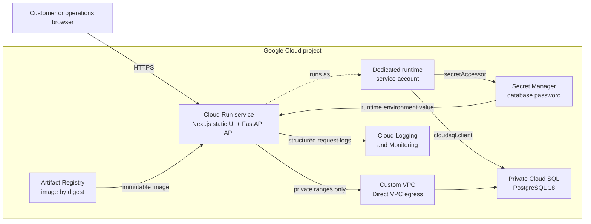
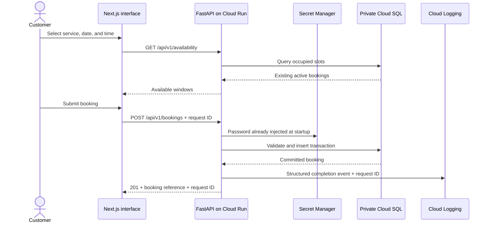
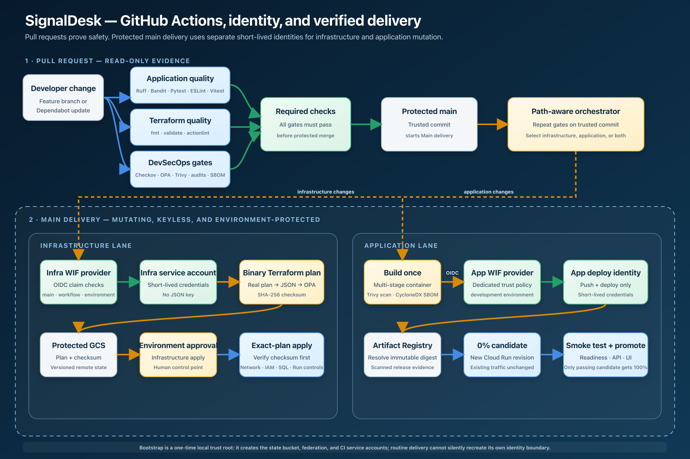
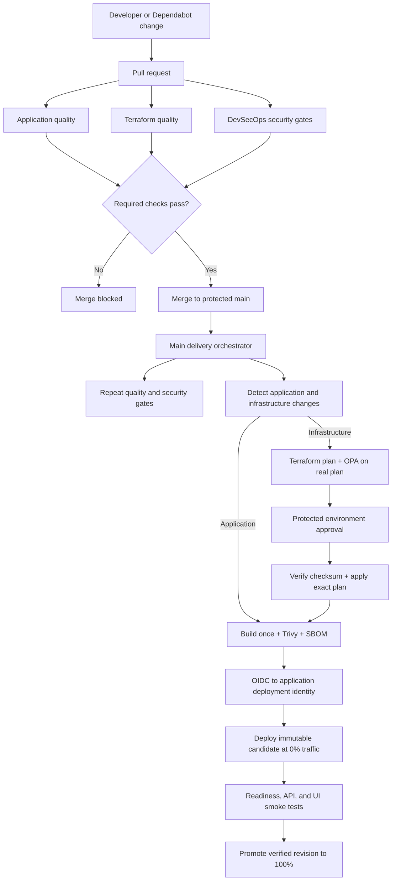

# SignalDesk Cloud Launch case study

## Project summary

**SignalDesk Cloud Launch** is a production-style Google Cloud reference
implementation for a small field-service business that needs online booking
without operating servers or Kubernetes.

The deployed product combines a responsive Next.js interface, a FastAPI API,
and PostgreSQL persistence in one Cloud Run service. Terraform provisions the
platform, GitHub Actions provides keyless and policy-gated delivery, and Google
Cloud supplies private database networking, secret delivery, logs, monitoring,
and cost guardrails.

This is a portfolio lab built with synthetic data, not a client case study. It
demonstrates a production engineering approach while stating the controls that
would still be required before processing real customer data.

## Business problem

A small service company wants customers to reserve appointment windows online
and wants operations staff to manage those bookings. The company has a lean
engineering team and cannot justify a Kubernetes platform or a collection of
manually maintained virtual machines.

The technical problem is broader than hosting a web page. The business needs:

- one repeatable way to create the cloud foundation;
- a transactional database that is not exposed to the public internet;
- safe application releases that do not send customers to an untested build;
- useful health signals and request-level troubleshooting;
- protection from unbounded serverless scaling and surprise cloud bills;
- CI/CD without a permanent Google service-account key in GitHub;
- evidence that infrastructure and application changes passed security gates;
- a documented path for rollback, recovery, and future hardening.

The target client is a startup, small business, or engineering team launching a
transactional application on GCP without a dedicated platform team.

## Verified outcome

The full-stack release was deployed on 2026-07-31 by
[Main delivery run 30669346499](https://github.com/lucien95/signaldesk-cloud-launch/actions/runs/30669346499).

- Active Cloud Run revision: `signaldesk-dev-00005-nik`.
- Production traffic: 100% to the verified revision.
- Trusted source commit: `853500273f674daa0e97f5737eed15d92754abdf`.
- Immutable image digest:
  `sha256:addccfd244f9c119a544b303afe669e1126038c1baefdcb0fe12913530f79a52`.
- Runtime: 1 vCPU, 512 MiB, request-based billing, minimum zero instances,
  maximum three instances.
- Database: private-IP Cloud SQL for PostgreSQL 18 with automated backups and
  point-in-time recovery.
- Delivery credentials: short-lived GitHub OIDC tokens; both CI service
  accounts have zero user-managed keys.

The live development demonstration is available at
<https://signaldesk-dev-s2wvuscfya-ue.a.run.app>.

## System architecture

The diagram separates three controls that are often incorrectly described as
one “service-account login”: IAM authorizes the Cloud Run workload, private
Google networking carries the connection, and PostgreSQL validates the
database user plus the password injected from Secret Manager.

### Why one Cloud Run service

Next.js builds the customer and operations interface as a static export. A
multi-stage container build copies those static assets into the final Python
image, and FastAPI serves them at `/` while serving JSON endpoints under
`/api/v1`.

That choice gives the first release one public origin, one deployable artifact,
one scaling boundary, and no cross-origin browser configuration. It also avoids
paying for a second idle runtime. The frontend is still a Next.js/React
application; FastAPI is the backend and the production static-file server.

This is not the only valid design. A larger team could deploy the frontend and
API independently to scale and release them separately. For this client size,
the operational simplicity of one container is more valuable.

## How a booking crosses the system

The browser performs friendly validation, but it is not trusted. FastAPI
revalidates the service, future timestamp, weekday, configured Eastern-time
window, and request body. A database uniqueness rule and API conflict handling
prevent two active bookings from silently taking the same slot.

Operations staff can search and filter bookings, then complete or cancel them.
Terminal bookings cannot be reopened. In this public lab the board contains
only synthetic records and is deliberately not protected by staff identity.

## The three authentication layers

One of the most important lessons in this project is that “the service account
authenticates to the database” is incomplete. Three different trust decisions
occur.

### 1. GitHub Actions to Google Cloud

GitHub creates an OIDC identity token for the trusted workflow. Google Cloud
Workload Identity Federation evaluates claims including the immutable
repository and owner IDs, branch, workflow path, and GitHub environment. If the
claims match, Google issues short-lived credentials for either the
infrastructure deployment service account or the application deployment
service account.

No Google service-account JSON key is downloaded or stored in GitHub.

### 2. Cloud Run workload to Google Cloud resources

The running container uses a third, dedicated runtime service account. IAM
allows that identity to access the configured Secret Manager secret and use
the Cloud SQL connection integration. This answers: “Is this workload allowed
to reach those Google Cloud resources?”

The runtime service account is not the PostgreSQL user in this release.

### 3. Application to PostgreSQL

Cloud Run injects the latest database-password secret version into the
container as `DB_PASSWORD`. The application combines it with `DB_USER`,
`DB_NAME`, and the Cloud SQL connection name. SQLAlchemy and the PostgreSQL
driver then authenticate as the database user `signaldesk_app`.

IAM authorizes the secure route to Cloud SQL and access to the secret;
PostgreSQL separately validates the database username and password. This
separation is why granting `roles/cloudsql.client` alone does not log the
application into PostgreSQL.

## Private database networking

Cloud SQL has no public IPv4 address. Terraform creates a custom VPC, reserves
an internal address range for Private Service Access, and connects the service
networking API. Cloud Run uses Direct VPC egress for private ranges to reach
the database.

Direct VPC egress was selected instead of a Serverless VPC Access connector to
avoid connector instances and their recurring cost. The subnet has flow logs,
and the database connection still requires Cloud SQL authorization and
database credentials; a private address does not replace authentication.

## Terraform structure and the bootstrap problem

The repository intentionally has two Terraform roots:

| Root | Responsibility | How it is operated |
|---|---|---|
| `terraform/bootstrap` | State bucket, Workload Identity Federation, CI service accounts, and initial IAM | Reviewed and applied locally as a one-time trust root |
| `terraform/environments/dev` | Network, Cloud SQL, secret, Cloud Run, Artifact Registry, monitoring, logging, and budget | Planned and applied by protected GitHub Actions delivery |

Bootstrap cannot initially store its own state in the GCS bucket because that
bucket does not exist yet. Its first apply therefore uses temporary local
state. Immediately afterward, the state is migrated into the private,
versioned bucket that bootstrap created.

Bootstrap is deliberately excluded from automatic delivery. It defines the
identity that authorizes automatic delivery, so silently allowing that same
pipeline to rewrite its own trust boundary would weaken the design.

## Terraform and application ownership

Terraform owns the Cloud Run platform configuration: identity, networking,
secrets, resources, probes, scaling, labels, and exposure. The application
workflow owns the container image and revision promotion.

Terraform ignores the image and release-generated revision/client metadata.
Without that ownership boundary, a later Terraform apply could roll the
service back to an old placeholder image, while a new application deployment
could appear as permanent Terraform drift.

The design still drift-detects the controls Terraform is supposed to own. A
post-release Terraform 1.15.8 run returned `No changes`, proving that the two
delivery paths had reconciled cleanly.

## CI/CD and DevSecOps lifecycle

Pull-request jobs produce read-only evidence. Only a protected `main` commit
can enter the mutating delivery lanes, and infrastructure and application
changes receive different short-lived Google Cloud identities.

### Pull-request evidence

- Ruff and Bandit check Python quality and security.
- Pytest checks API validation, persistence, conflicts, filtering, and status
  transitions.
- ESLint, Vitest, and the Next.js production build check the frontend.
- Playwright executes customer and operations journeys in desktop Chrome and a
  mobile viewport.
- Terraform format and validation run for both Terraform roots.
- actionlint checks GitHub workflow syntax.
- Checkov provides broad Terraform misconfiguration coverage.
- OPA tests enforce project-specific rules that generic scanners cannot know.
- Trivy scans source, IaC, secrets, dependencies, and the built image.
- pip-audit and npm audit check dependency advisories.
- CycloneDX SBOMs preserve component evidence for the test and release images.

### Why Checkov, OPA, and Trivy all exist

Their responsibilities overlap but are not identical:

- Checkov recognizes common cloud and Terraform security mistakes.
- OPA expresses SignalOps business rules, such as the maximum Cloud Run scale
  and which service may be public, and evaluates the real Terraform plan.
- Trivy finds vulnerable packages and secrets in the repository and the
  container that will actually run.

Passing one tool is not equivalent to passing all three perspectives.

### Exact-plan infrastructure apply

Main delivery creates a binary Terraform plan, converts it to JSON for OPA,
hashes it, and stores the plan plus checksum in the protected state bucket. The
apply job starts only after the protected GitHub environment permits it. It
downloads the saved plan, verifies the checksum, and applies that exact binary
artifact rather than generating a new proposal after approval.

### Zero-traffic application promotion

The deployment workflow builds the image once, scans it, generates an SBOM,
pushes it to Artifact Registry, and resolves the immutable digest. Cloud Run
creates a candidate revision with zero production traffic. The workflow tests
database-backed readiness, the service catalog API, and the frontend marker on
the candidate URL. Only a passing candidate receives 100% of traffic.

If candidate validation fails, the existing revision keeps serving customers.

## Observability and reliability

Every response has a request ID. The API writes structured completion events
with the request ID, method, path, status code, duration, and Cloud Run revision
metadata. An operator can start with a booking confirmation's request ID and
find the matching Cloud Logging entry.

The application exposes:

- `/health/live` for process liveness;
- `/health/ready` for a database-backed readiness check;
- startup and liveness probes in Cloud Run;
- a Cloud Monitoring uptime check and alert policy;
- VPC flow logs and selected audit logs for platform evidence.

Cloud SQL has automated backups and point-in-time recovery. These settings are
not treated as proof of recovery: a timed restore drill remains required.

## Cost controls

- Cloud Run scales to zero and cannot exceed three instances.
- Cloud SQL uses a small zonal development tier.
- Database disk autoscaling has a ceiling.
- Direct VPC egress avoids always-on connector instances.
- Artifact Registry deletes old untagged images.
- Temporary Terraform plans and CI evidence have retention limits.
- A USD 10 monthly budget alerts at 50%, 90%, and 100%.

The budget is an alert, not a hard spending cap. Cloud SQL remains the dominant
always-on development cost until it is stopped or destroyed.

## Engineering problems encountered

This project became a stronger proof asset because the implementation exposed
real integration problems:

- Trivy rejected the original public-IP database design, leading to Private
  Service Access and Direct VPC egress.
- Cloud SQL rejected an incompatible edition and machine-tier combination.
- Cloud Run rejected an unsupported probe configuration.
- Terraform plan JSON normalized resource names differently from source code,
  requiring the custom OPA policy to evaluate the actual plan representation.
- A nested `gcloud` formatting command initially failed to identify the
  candidate revision; the existing revision safely retained all traffic.
- Terraform and the application deployment initially competed over Cloud Run
  release metadata until an explicit ownership boundary eliminated drift.

These are more useful interview examples than a perfect first apply because
they show how logs, plans, provider behavior, and safety controls were used to
diagnose and correct the system.

## Security boundary and honest limitations

This project demonstrates a production-style platform, but the public
development application intentionally uses synthetic data. Before a real
customer deployment, the next controls would be:

- staff identity and role-based authorization for operations endpoints;
- rate limiting and abuse protection;
- a custom domain, managed TLS edge, and Cloud Armor;
- schema migrations rather than startup table creation;
- asynchronous and idempotent email/SMS notifications;
- IAM database authentication if supported by the operating model;
- high-availability Cloud SQL where the recovery objective justifies the cost;
- a completed rollback, alert, restore, and load-test evidence set;
- a documented data retention and privacy policy.

The project does not claim these incomplete controls as implemented.

## Deliverables

- Deployable Terraform bootstrap and development environment.
- Versioned remote state and protected exact-plan delivery.
- Responsive booking and operations application.
- FastAPI API with PostgreSQL persistence and request correlation.
- Keyless GitHub-to-GCP authentication with separated identities.
- Checkov, OPA, Trivy, actionlint, dependency audit, and SBOM gates.
- Private Cloud SQL networking and Secret Manager integration.
- Cloud Logging, Monitoring, health probes, and uptime checking.
- Budget, scaling, storage, image, and artifact guardrails.
- Deployment, security, cost, application, rollback, and evidence documents.

## SignalOps service mapping

The primary engagement is **Cloud Foundation Launch**: identity, remote state,
networking, managed runtime, database, secrets, observability, budgets, and
runbooks. The delivery system maps to a **Secure Delivery / DevSecOps
Accelerator**. Scaling and lifecycle controls map to **Cloud Cost Guardrails**,
while health signals, log correlation, rollback, and recovery exercises map to
a **Reliability Baseline**.

## Proof links

- [Source repository](https://github.com/lucien95/signaldesk-cloud-launch)
- [Successful full-stack Main delivery](https://github.com/lucien95/signaldesk-cloud-launch/actions/runs/30669346499)
- [Live development application](https://signaldesk-dev-s2wvuscfya-ue.a.run.app)
- [Architecture decisions](architecture.md)
- [Application walkthrough](application.md)
- [Deployment guide](deployment.md)
- [DevSecOps walkthrough](devsecops.md)
- [Security model](security.md)
- [Cost model](cost-model.md)
- [Sanitized deployment evidence](evidence/deployment-verification.md)
- [Rollback runbook](runbooks/rollback.md)
