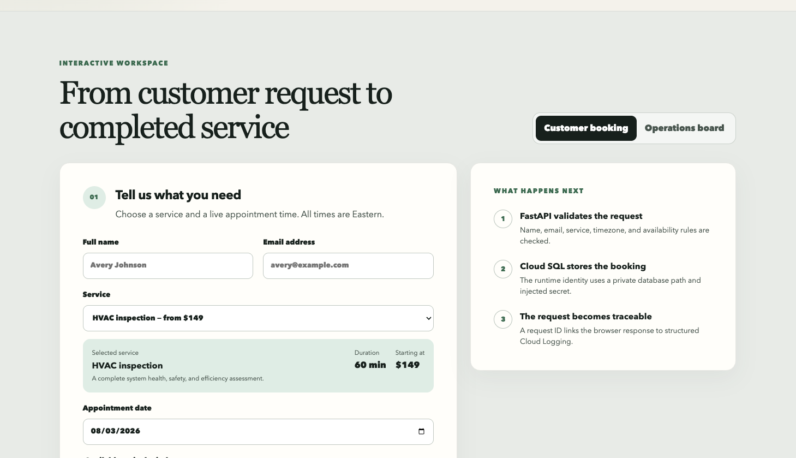
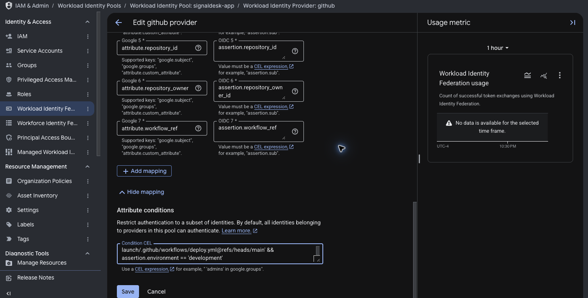
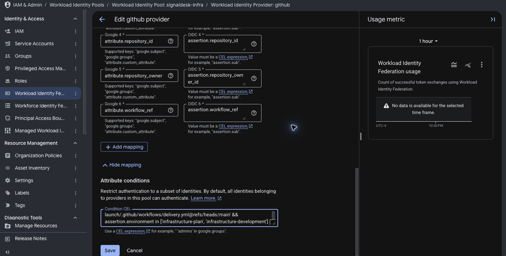
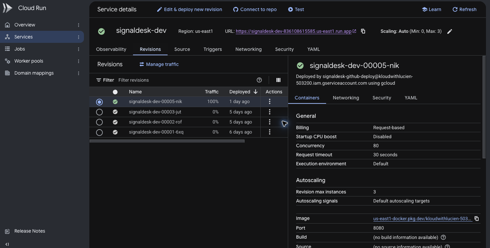
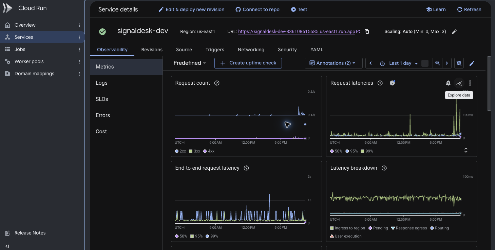
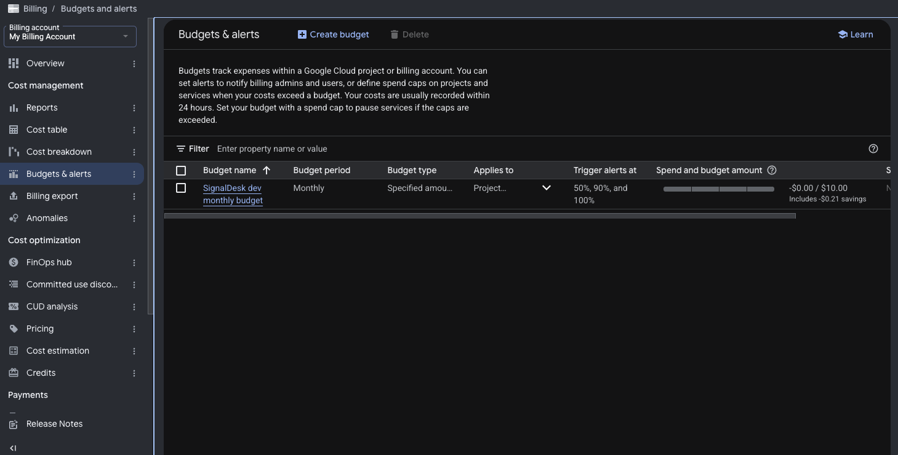

# Building a production-style booking platform on GCP with Terraform and keyless GitHub Actions

_A practical walkthrough of Cloud Run, private Cloud SQL, Secret Manager,
Workload Identity Federation, policy-gated Terraform, and zero-traffic release
promotion._


Small businesses rarely ask for “a platform.” They ask for something concrete:
let customers book a service online, let staff manage the work, keep the data
safe, and do not create an unpredictable cloud bill.

That simple request becomes a platform-engineering problem as soon as the
application needs a database, secrets, CI/CD, monitoring, rollback, and a safe
way to change infrastructure.

I built **SignalDesk Cloud Launch** as a deployable Google Cloud reference
implementation for that situation. It is a fictional field-service booking
product using synthetic data, but the infrastructure and delivery controls are
real and deployed.

This article focuses on the integration points—the places where cloud projects
usually become confusing:

- how one Cloud Run container serves a Next.js interface and FastAPI API;
- how Cloud Run reaches a private PostgreSQL database;
- why a service account does not replace the PostgreSQL login;
- how GitHub authenticates to GCP without a JSON key;
- why Terraform bootstrap is separate from normal delivery;
- how Checkov, OPA, and Trivy provide different security evidence;
- how a candidate revision is tested before receiving production traffic;
- how one browser request is traced into Cloud Logging;
- how scaling and budget controls limit financial risk.

The source, Terraform, workflows, policies, runbooks, and sanitized evidence are
available in the
[SignalDesk repository](https://github.com/lucien95/signaldesk-cloud-launch).

## The business problem

The target client is a startup or small service business without a dedicated
platform team. Customers need to reserve real appointment windows, and an
operations team needs to search, complete, or cancel those bookings.

The platform must provide:

- repeatable infrastructure instead of undocumented console changes;
- a transactional database with no public IP address;
- separate identities for infrastructure deployment, application deployment,
  and application runtime;
- no permanent Google Cloud key in GitHub;
- release validation before customers reach a new container;
- logs that connect a customer action to a backend request;
- bounded serverless scaling and explicit budget notifications;
- documented limitations instead of an unsupported “production-ready” claim.

I chose Cloud Run rather than Kubernetes because the client problem does not
require cluster or node operations. PostgreSQL fits bookings because slot
conflicts and status changes are transactional business rules.

## Architecture


This view deliberately separates identity, transport, and database
authentication. The Cloud Run service account authorizes access to Google
Cloud resources. Direct VPC egress and Private Service Access provide the
private network route. PostgreSQL still validates `DB_USER` and the password
injected from Secret Manager.

The deployed request path is:

```text
Browser
  → public Cloud Run HTTPS endpoint
    → Next.js static interface at /
    → FastAPI routes under /api/v1
      → SQLAlchemy and PostgreSQL driver
        → Cloud SQL integration
          → Direct VPC egress
            → Private Service Access
              → private Cloud SQL for PostgreSQL
```

Terraform also provisions Artifact Registry, Secret Manager, logging and
monitoring controls, a GCS state backend, a billing budget, and the IAM trust
needed by GitHub Actions.

## Why Next.js and FastAPI run together

The frontend is Next.js/React. The backend is FastAPI—not React.

A multi-stage Docker build compiles the Next.js interface as a static export.
The final non-root Python image contains the FastAPI service and the compiled
frontend assets. FastAPI serves the interface at `/` and the API under
`/api/v1`.

For this project, one container creates useful simplicity:

- one public origin, so no CORS configuration is required;
- one immutable image to scan and release;
- one Cloud Run scaling boundary;
- one place to correlate user requests and runtime logs;
- no second idle service to pay for.

A larger product team might deploy the frontend and API separately for
independent release cadence. For a lean team and a small transactional
application, the operational simplicity was the more valuable tradeoff.

## Following a real booking through the platform

The frontend first requests the service catalog and available windows.



When a customer selects a service and date, FastAPI validates the date and
business schedule, queries PostgreSQL for active bookings, removes occupied
slots, and returns the remaining windows.


The browser provides friendly validation, but the API repeats every important
rule because the browser is not a trust boundary. The server validates the
service, timezone-aware future timestamp, weekday, and configured Eastern-time
window. The database and API conflict handling prevent two active bookings
from silently occupying the same slot.

After submission, the API returned booking reference `SD-64B1C9D1` and request
ID `5c59ba5f-45c7-4670-aecb-7b30a5bd7e00`. The selected time immediately
changed from available to booked.


The operations board then issued a separate API read and retrieved the
persisted record from PostgreSQL.


Finally, completing the job changed its state from confirmed to completed. The
backend committed the update, the board refreshed, and the record became
terminal. That update received its own request ID.


This sequence is more useful than a static landing page because it manually
exercises create, read, availability, and state-transition paths through the
deployed infrastructure.

## Three identities—not one database login

This was the most important concept to make explicit.

### GitHub deployment identity

GitHub Actions starts with a signed OIDC token. Google Cloud Workload Identity
Federation validates the issuer and evaluates claims about the repository,
owner, branch, workflow, called workflow, and GitHub environment. An accepted
job receives short-lived credentials for one deployment service account.

There are separate application and infrastructure Workload Identity pools.


The application provider requires the trusted application release path on
`main` in the `development` environment. The infrastructure provider accepts
only the trusted main delivery workflow in the `infrastructure-plan` or
`infrastructure-development` environments.





The mapping does not grant permission by itself. It translates signed GitHub
claims into Google attributes. The condition decides whether the external
identity is admissible, and a service-account IAM binding determines which
accepted principal may impersonate that service account.

Both CI service accounts have zero user-managed keys.

### Cloud Run runtime identity

The GitHub identity deploys the revision, but the container runs as a different
service account: `signaldesk-dev-runtime`.


IAM allows that runtime identity to access the configured secret and use the
Cloud SQL connection. A routine application process does not inherit Terraform
administration or image-publishing privileges.

### PostgreSQL identity

The runtime service account is not the PostgreSQL user in this release.

Cloud Run injects `DB_PASSWORD` from the
`signaldesk-dev-database-password` Secret Manager resource. The container also
receives `DB_USER=signaldesk_app`, `DB_NAME=signaldesk`, and the instance
connection name.


The division of responsibility is:

```text
Cloud Run service account
  → authorizes access to Secret Manager and Cloud SQL integration

PostgreSQL username + injected password
  → authenticates the application database session
```

IAM answers whether the workload may reach Google Cloud resources. PostgreSQL
separately decides whether the database credentials are valid.

## The database is private by network design

Cloud SQL has public IP connectivity disabled. It uses Private Service Access
on the dedicated `signaldesk-dev` VPC and has an internal address. SSL-only
connections are enabled.


Cloud Run uses Direct VPC egress for private ranges. I chose it instead of a
Serverless VPC Access connector to avoid always-on connector instances and
their recurring cost.

A private address is not a replacement for authentication. A successful
database connection still requires:

1. a workload authorized to use the Cloud SQL integration;
2. a route through the configured VPC;
3. the correct PostgreSQL username and password;
4. the expected database and encrypted connection.

## Solving Terraform's bootstrap problem

The repository contains two Terraform roots:

| Terraform root | Responsibility | Operation |
|---|---|---|
| `terraform/bootstrap` | GCS state bucket, CI service accounts, Workload Identity pools/providers, initial IAM | Reviewed and applied locally once |
| `terraform/environments/dev` | VPC, Cloud SQL, secret, Cloud Run, Artifact Registry, monitoring, logging, and budget | Delivered by protected GitHub Actions |

The first bootstrap cannot store its state in a bucket that does not exist.
The initial apply therefore uses temporary local state. Immediately after the
bucket is created, bootstrap state is migrated into the private, versioned GCS
backend.

Bootstrap remains outside routine CI/CD because it defines the identity and
permissions that CI/CD trusts. Allowing the same pipeline to silently rewrite
its own trust root would weaken the boundary.

## Pull-request gates and path-aware delivery


Pull request 22 introduced the end-to-end booking interface. Before merge, six
jobs passed across three workflows.


The gates include:

- Ruff and Bandit for Python quality and security;
- Pytest for validation, persistence, conflicts, filtering, and state rules;
- ESLint, Vitest, and a Next.js production build;
- Playwright customer and operations journeys in desktop and mobile viewports;
- pip-audit and npm audit;
- Terraform format and validation for both roots;
- actionlint for workflow syntax;
- Checkov for broad Terraform misconfiguration coverage;
- OPA tests for project-specific rules;
- Trivy source, IaC, secret, dependency, and container scans;
- CycloneDX SBOM generation.

Checkov, OPA, and Trivy are not redundant. Checkov detects broadly known cloud
misconfigurations. OPA expresses business-specific rules, such as the maximum
Cloud Run scale and which development service may be public. Trivy evaluates
the filesystem and the actual container contents for vulnerabilities and
secrets.

After merge, Main delivery repeats the gates against the trusted `main` commit
and detects which components changed.

The full-stack commit was application-only, so Terraform plan/apply was
correctly skipped while application delivery ran.


An earlier infrastructure reconciliation demonstrated the opposite path:
Terraform plan/apply ran while application release was skipped.


This avoids unnecessary cloud mutations without weakening validation.

## Applying the exact Terraform plan

For an infrastructure change, the plan job:

1. authenticates with short-lived infrastructure credentials;
2. initializes locked remote state;
3. creates a binary Terraform plan;
4. converts it to JSON for policy evaluation;
5. runs SignalOps OPA rules against the real proposal;
6. computes a SHA-256 checksum;
7. stores the plan and checksum in the protected state bucket.


The apply job then downloads those artifacts, verifies the checksum, applies
only the binary plan, and removes the short-lived evidence after success.


This prevents approval of one proposal followed by execution of a newly
generated and potentially different plan.

## Testing a revision before it receives traffic

The application workflow builds the release candidate once. The same image is
scanned, published, resolved by digest, and deployed.

Cloud Run creates the candidate without production traffic. The workflow then
tests database-backed readiness, the API service catalog, and expected
frontend content on the candidate URL. Only a passing revision receives 100%
of traffic. The public URL is tested again after promotion.


This control was exercised during development. A faulty candidate lookup once
stopped the pipeline before smoke testing; the existing revision retained all
traffic. The failure exposed a workflow bug without exposing customers to the
candidate.

The verified full-stack release produced:

- active revision `signaldesk-dev-00005-nik`;
- trusted commit `853500273f674daa0e97f5737eed15d92754abdf`;
- immutable image digest
  `sha256:addccfd244f9c119a544b303afe669e1126038c1baefdcb0fe12913530f79a52`;
- 100% traffic to the verified revision.



## Request-level observability

Every response carries an `x-request-id`. The API emits structured JSON with
that identifier, the method, path, status, duration, and message.

Searching for the ID displayed in the customer confirmation returned one
matching Cloud Run record.


The parsed entry showed:

```text
message: request_completed
method: POST
path: /api/v1/bookings
status: 201
duration_ms: 180.78
request_id: 5c59ba5f-45c7-4670-aecb-7b30a5bd7e00
```


The logger does not record the booking body, customer name, or email. The
request is traceable without copying customer data into operational logs.

Cloud Run also exposes request count, response classes, percentile latency,
end-to-end latency, and a breakdown of ingress, pending, execution, routing,
and egress time.



## Cost guardrails

The development design deliberately limits recurring cost:

- Cloud Run minimum instances: zero;
- Cloud Run maximum instances: three;
- request-based billing;
- one vCPU and 512 MiB per instance;
- small zonal Cloud SQL tier;
- bounded database disk autoscaling;
- Direct VPC egress instead of connector instances;
- Artifact Registry cleanup for old untagged images;
- short retention for temporary plans and CI evidence;
- a monthly USD 10 budget with 50%, 90%, and 100% alerts.



A budget is an alerting mechanism, not a hard cap. Cloud SQL is an always-on
cost until it is stopped or destroyed, and alerts do not automatically shut
down the environment.

## Problems that improved the architecture

The most valuable lessons came from integration failures:

- Trivy rejected the original public-IP database design, leading to Private
  Service Access and Direct VPC egress.
- Cloud SQL rejected an incompatible edition and machine-tier combination.
- Cloud Run rejected an unsupported probe configuration.
- Terraform plan JSON normalized names differently from the source, requiring
  OPA to evaluate the provider's real plan representation.
- A nested `gcloud` formatting command failed to find the candidate revision;
  zero-traffic delivery kept the existing revision safe.
- Terraform and application deployment initially competed over Cloud Run image
  and revision metadata until the ownership boundary was made explicit.

Terraform now owns networking, identity, scaling, probes, resources, secrets,
and exposure. The application pipeline owns the image and revision promotion.
A later Terraform 1.15.8 run returned `No changes`.

## What I would add before real customer use

This is a production-style reference implementation, not a claim that every
production control is complete. The operations board is public and uses only
synthetic data.

The next production controls are:

- staff authentication and role-based authorization;
- rate limiting and abuse protection;
- custom domain, managed edge TLS, and Cloud Armor;
- schema migration tooling instead of startup table creation;
- asynchronous and idempotent email/SMS notifications;
- IAM database authentication where it fits the operating model;
- high-availability Cloud SQL when the recovery objective justifies the cost;
- completed rollback, failure-alert, restore, and load-test drills;
- a real data-retention and privacy policy.

Google-managed container threat-detection insights are also not enabled in
this lab. Trivy and CycloneDX provide the implemented CI release evidence;
managed registry scanning is an explicit hardening option.

## What this project demonstrates

The goal was not to accumulate cloud services. It was to show how product
behavior, cloud identity, network boundaries, database authentication,
infrastructure policy, release safety, observability, and cost controls fit
together in a system a small team could actually operate.

If I were explaining the project in one sentence during an interview:

> I built and deployed a transactional booking platform on Cloud Run with a
> private PostgreSQL data path, keyless GitHub-to-GCP authentication,
> policy-gated Terraform, immutable candidate promotion, request-correlated
> logging, and explicit cost and security boundaries.

## Project links

- [Source and documentation](https://github.com/lucien95/signaldesk-cloud-launch)
- [Live development application](https://signaldesk-dev-s2wvuscfya-ue.a.run.app)
- [Verified full-stack delivery run](https://github.com/lucien95/signaldesk-cloud-launch/actions/runs/30669346499)
- [SignalOps](https://www.signalcloudops.com)

_All records shown are synthetic. Billing identifiers, credentials, secret
payloads, Terraform state, and personal account information are excluded from
the published evidence._
