# What actually happens after a customer clicks “Confirm appointment”?

_An engineering field note on Cloud Run, private PostgreSQL, workload identity,
and the controls behind a small booking application._

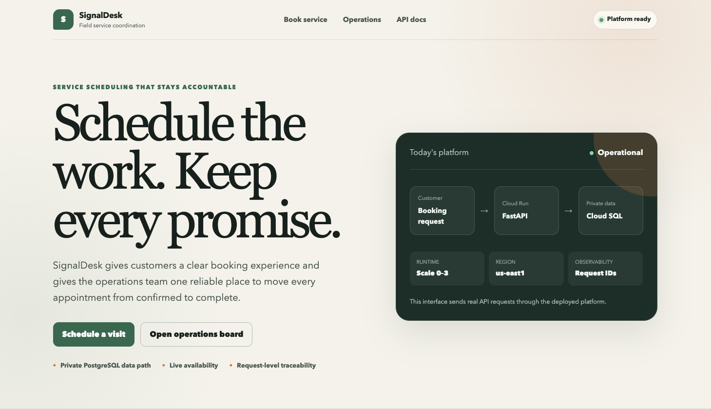

A booking form looks simple from the outside. Choose a service, choose a time,
enter a name, and click a button.

Behind that button, a real system has to answer several harder questions:

- Is the time still available?
- Can two customers reserve it simultaneously?
- Where does the database password live?
- How does the application reach a database with no public IP?
- How does GitHub deploy without storing a cloud key?
- What happens if the new container is broken?
- How do I trace one confirmation back to the backend?
- What prevents serverless scaling from surprising a small business?

I built SignalDesk Cloud Launch to make those connections visible. It is a
deployed GCP portfolio lab for a fictional field-service company, using only
synthetic data.

## Start with the product journey

The customer interface is a statically exported Next.js application. FastAPI
serves that interface and exposes the API from the same Cloud Run container.

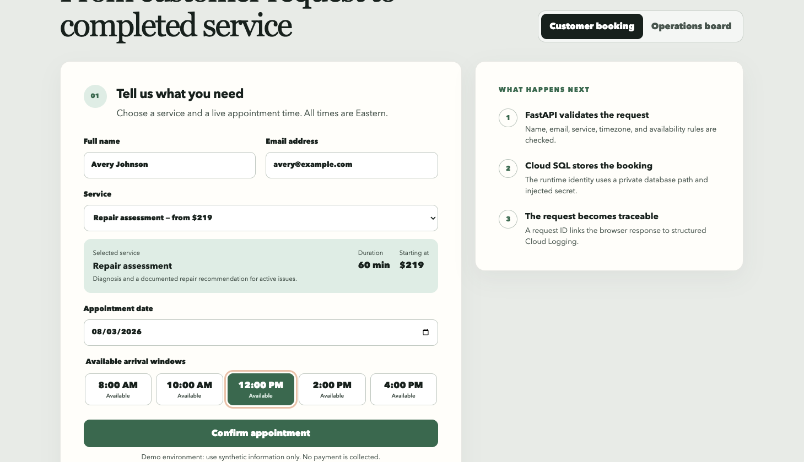

When the user chooses a date, the frontend requests availability. FastAPI
validates the business schedule and queries PostgreSQL for occupied slots. It
returns the remaining windows, and the browser renders them.

When the customer confirms, the browser sends a booking request. The API
validates the same rules again—the browser is never the final trust boundary—
and commits the record.

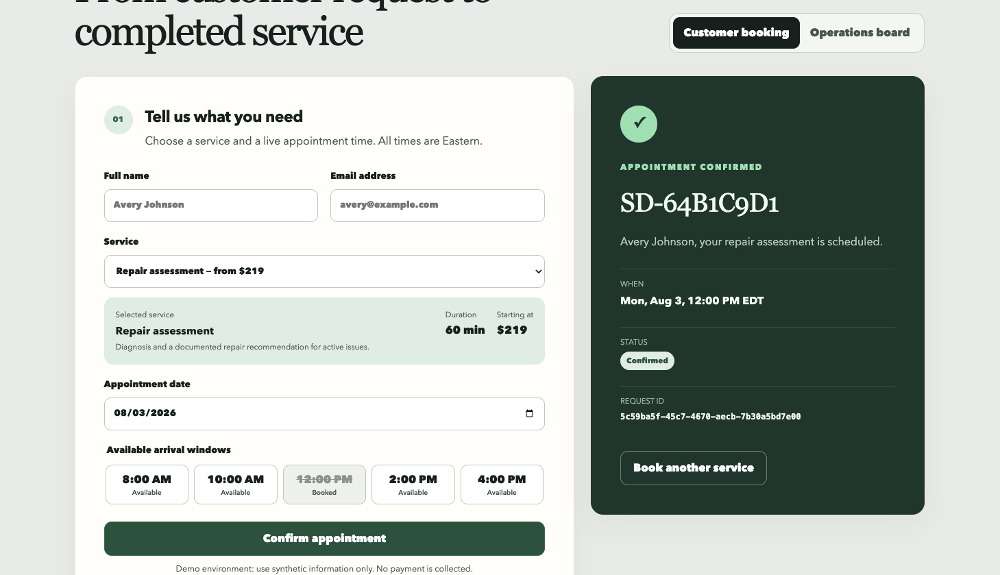

The response contains two identifiers with different purposes:

- `SD-64B1C9D1` is the business booking reference.
- `5c59ba5f-45c7-4670-aecb-7b30a5bd7e00` is the request-correlation ID.

The operations board searches business records using a customer or booking
reference. The request ID belongs in observability tooling, not the booking
search box.

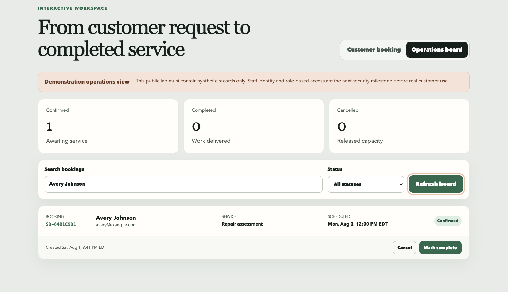

Completing the booking exercises a second write path. The API permits the
confirmed-to-completed transition, commits it, and prevents the terminal record
from being reopened.

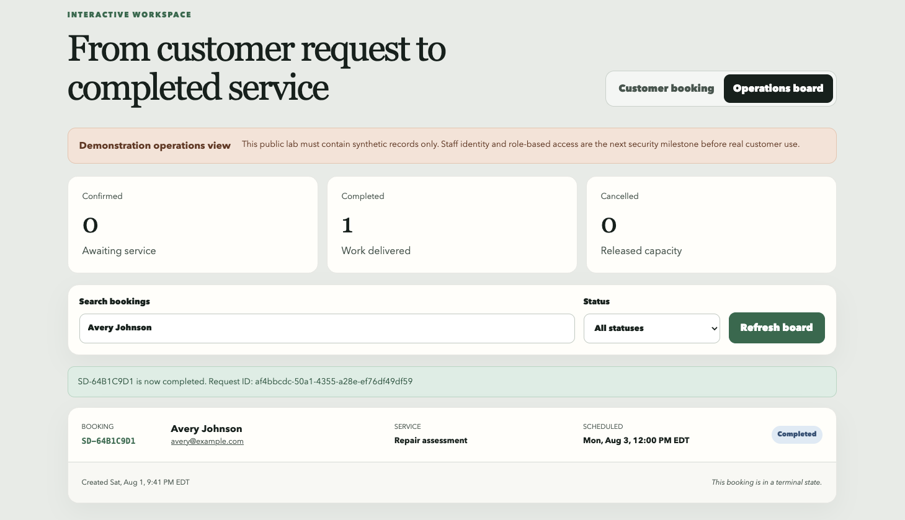

That small workflow tests more infrastructure than a static demo ever could:
public HTTPS, frontend/API integration, server validation, secret delivery,
private database networking, PostgreSQL transactions, structured logging, and
state refresh.

## The service account is not the database user

This distinction is easy to blur.

The Cloud Run container executes as
`signaldesk-dev-runtime@...iam.gserviceaccount.com`. IAM permits that workload
to use the Cloud SQL connection and access the configured secret.

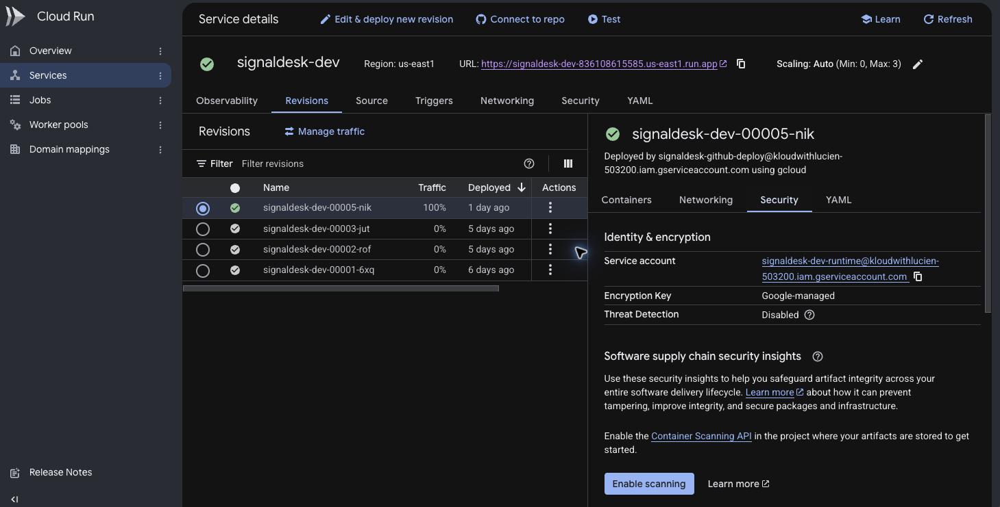

Cloud Run injects the database password from Secret Manager. The application
then logs into PostgreSQL as `signaldesk_app`.

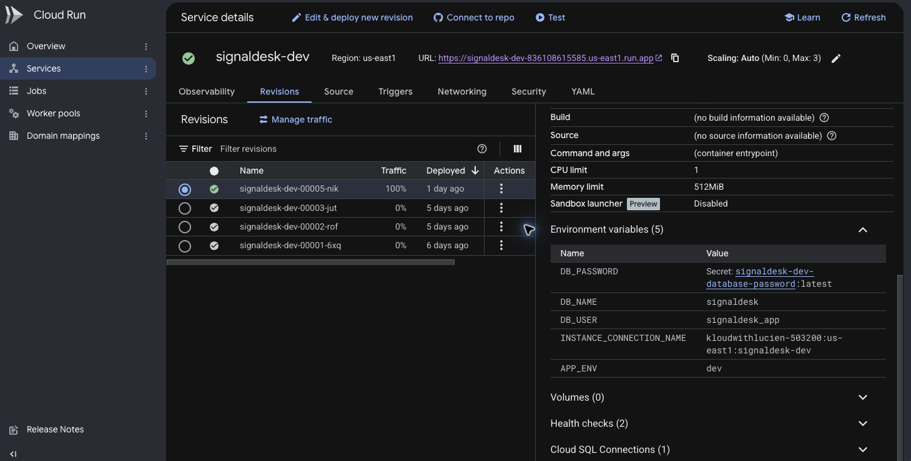

So there are two checks:

```text
IAM: Is this workload allowed to reach Cloud SQL and the secret?
PostgreSQL: Is this database username/password valid?
```

Granting `roles/cloudsql.client` does not magically turn a Google service
account into a PostgreSQL role in this design.

## Private is a route, not a complete security model

The database has no public IP. Cloud Run sends private-range traffic into the
dedicated VPC using Direct VPC egress. Private Service Access connects that VPC
to Cloud SQL's Google-managed service network.

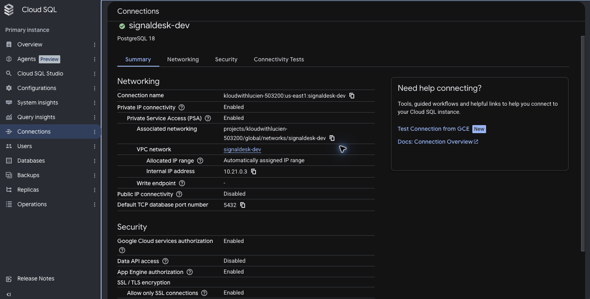

The internal address reduces internet exposure, but credentials and IAM are
still required. Good security comes from layers, not from calling one subnet
private.

## GitHub receives temporary credentials

There is no Google JSON key in the repository or GitHub Actions settings.

GitHub signs an OIDC token. Workload Identity Federation maps claims from that
token, evaluates strict conditions, and lets an accepted principal impersonate
one service account for a short period.

Separate pools isolate application deployment from infrastructure delivery.

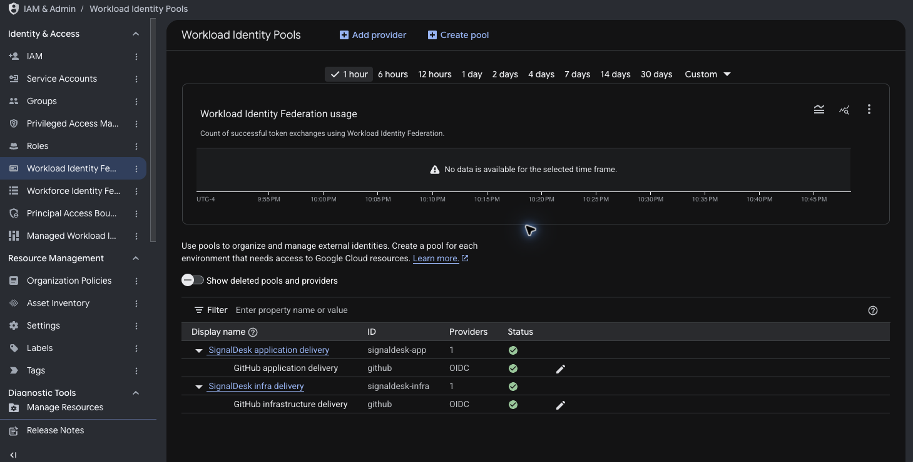

The conditions restrict immutable repository and owner IDs, the `main` branch,
specific workflow paths, and expected GitHub environments. A token from a fork,
different repository, different branch, or different workflow should not match
the trust rule.

## Pull requests validate; Main delivery mutates

The pull request ran application tests, dependency audits, Terraform
validation, Checkov, custom OPA policies, Trivy scans, and SBOM generation.

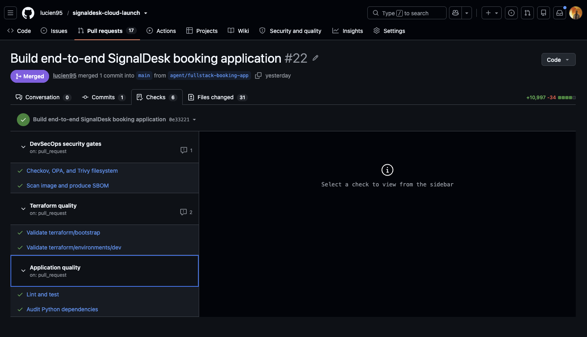

Those checks are read-only. After merge, Main delivery repeats the gates on the
trusted commit, detects which components changed, and selects the smallest
necessary delivery path.

An application-only change skipped Terraform apply.

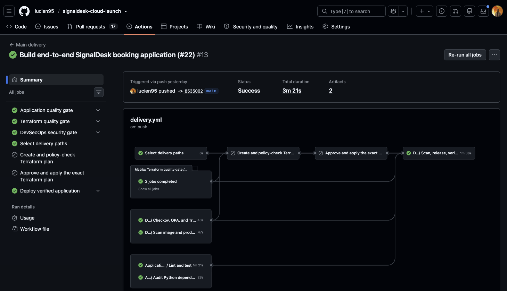

An infrastructure-only change planned and applied Terraform while skipping the
application release.

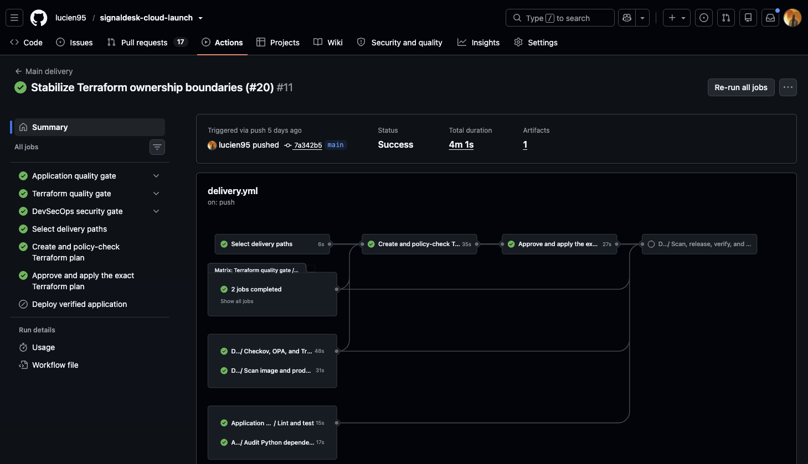

Path-aware delivery saves time and reduces unnecessary cloud mutation, but it
does not skip the shared validation gates.

## “Approved plan” should mean the plan that is applied

The infrastructure plan job creates a binary plan, converts it to JSON for OPA,
hashes it, and stores it with the checksum.

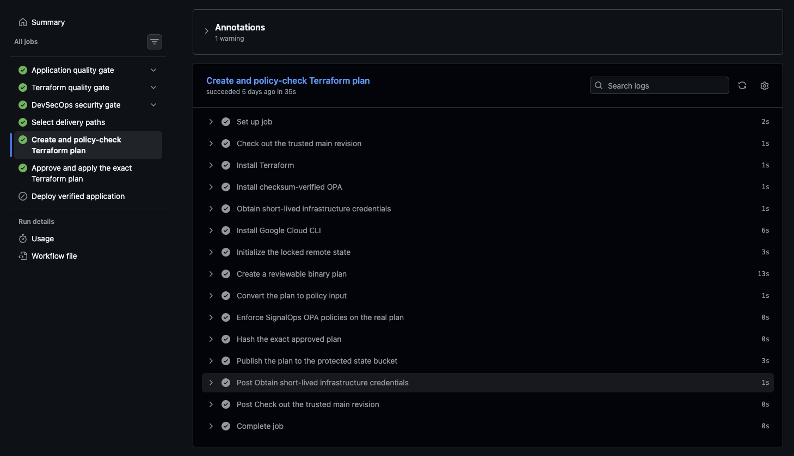

The apply job downloads both files, verifies the checksum, and applies only the
saved plan.

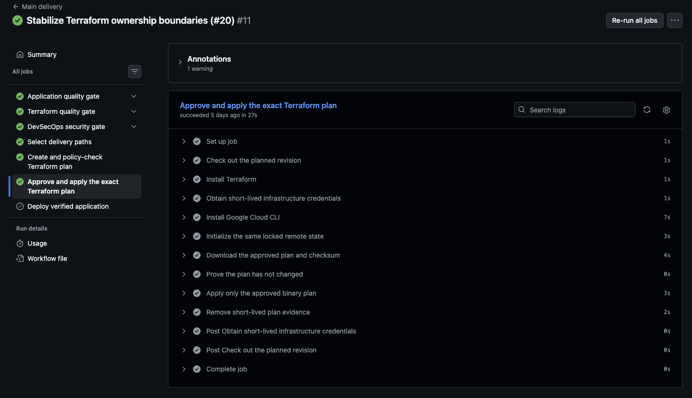

That prevents the dangerous pattern of reviewing one plan and generating a
different one during apply.

## “Deployed” should not immediately mean “serving”

The application pipeline builds the image once, scans it with Trivy, generates
an SBOM, publishes it, resolves the digest, and deploys a candidate revision
with zero production traffic.

Only after database readiness, API, and frontend checks pass does the workflow
move traffic to the candidate.

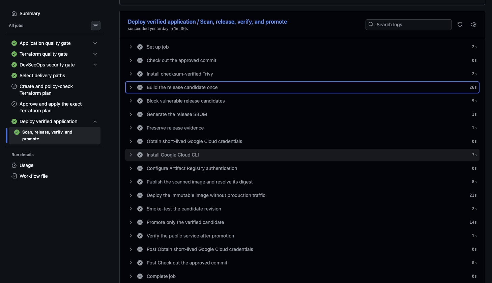

The active revision is deployed by immutable digest and receives 100% of
traffic. Older revisions remain available as rollback targets.

## Close the loop with one request ID

The ID shown to the customer returned exactly one `request_completed` record in
Cloud Logging.

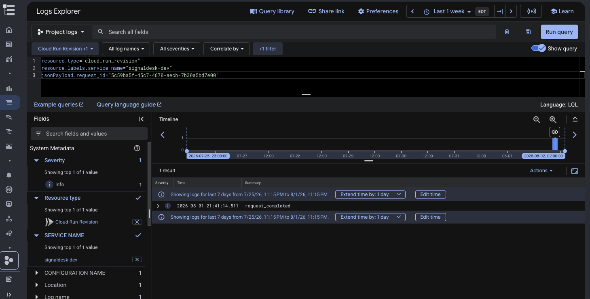

The structured event contained the method, path, status, duration, and request
ID—but not the customer name, email, or request body.

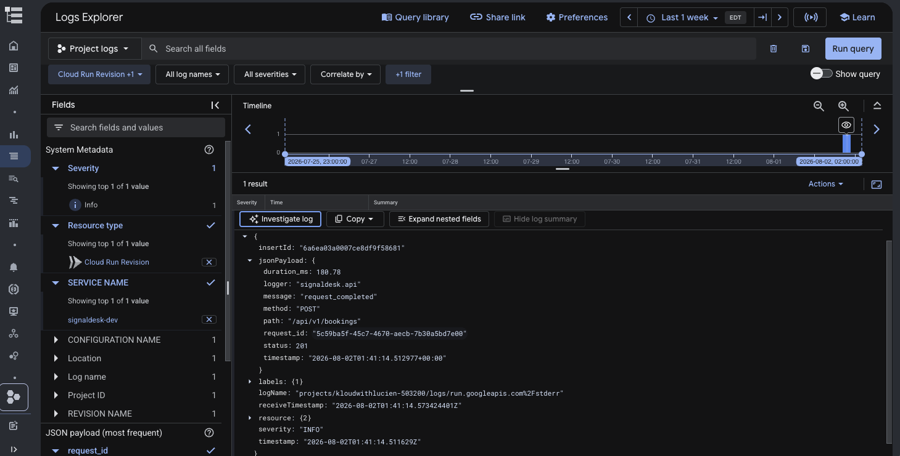

That is the observability goal: enough context to investigate without turning
logs into a second customer-data store.

## The honest boundary

SignalDesk is a production-style engineering reference, not a production client
system. The public operations board uses synthetic data. Before processing real
customer information, I would add staff identity and roles, rate limiting,
managed edge protection, schema migrations, notification workers, a defined
retention policy, and completed restore/load/alert drills.

The monthly USD 10 budget sends alerts at 50%, 90%, and 100%; it does not stop
the always-on Cloud SQL cost.

That honesty is part of the architecture. A portfolio should distinguish what
was deployed and verified from what belongs on the production roadmap.

## Explore the project

- [GitHub repository](https://github.com/lucien95/signaldesk-cloud-launch)
- [Live synthetic-data application](https://signaldesk-dev-s2wvuscfya-ue.a.run.app)
- [Verified full-stack delivery](https://github.com/lucien95/signaldesk-cloud-launch/actions/runs/30669346499)
- [SignalOps](https://www.signalcloudops.com)

If you are building a small transactional application, the main lesson is not
“use these exact services.” It is to make every trust handoff explicit: source
to pipeline, pipeline to cloud, workload to platform, application to database,
and customer action to operating evidence.

